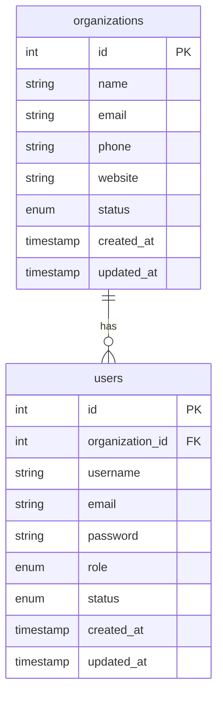

```mermaid
erDiagram
    organizations ||--o{ users : has
    organizations {
        int id PK
        string name
        string email
        string phone
        string website
        enum status
        timestamp created_at
        timestamp updated_at
    }
    users {
        int id PK
        int organization_id FK
        string username
        string email
        string password
        enum role
        enum status
        timestamp created_at
        timestamp updated_at
    }
```